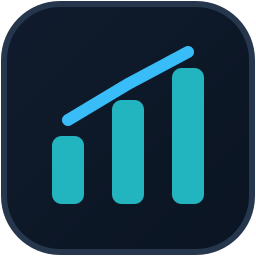
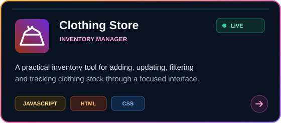

<!-- GitHub profile README -->

  

  
  
  

  <a href="#about">About</a>
  &nbsp;&middot;&nbsp;
  <a href="#toolkit">Toolkit</a>
  &nbsp;&middot;&nbsp;
  <a href="#featured-work">Featured work</a>
  &nbsp;&middot;&nbsp;
  <a href="#connect">Connect</a>

## About

I am a Full Stack Developer based in Israel, focused on building clean, responsive web applications with thoughtful architecture and polished user experiences. I enjoy turning product ideas into complete interfaces, connecting them to reliable data flows, and refining the details that make software feel considered.

<table>
  <tr>
    <td width="33%" valign="top">
      <strong>Interface engineering</strong> 
      Responsive React experiences, reusable components and deliberate interaction design.
    </td>
    <td width="33%" valign="top">
      <strong>Application architecture</strong> 
      Typed models, routing, global state and clear separation between UI and services.
    </td>
    <td width="33%" valign="top">
      <strong>APIs and data</strong> 
      REST integrations, real-time market streams, Express services and MySQL workflows.
    </td>
  </tr>
</table>

## Toolkit

<table>
  <tr>
    <td align="center" width="20%"> <strong>React</strong></td>
    <td align="center" width="20%"> <strong>TypeScript</strong></td>
    <td align="center" width="20%"> <strong>JavaScript</strong></td>
    <td align="center" width="20%"> <strong>HTML5</strong></td>
    <td align="center" width="20%"> <strong>CSS3</strong></td>
  </tr>
  <tr>
    <td align="center"> <strong>Redux Toolkit</strong></td>
    <td align="center"> <strong>React Router</strong></td>
    <td align="center"> <strong>Axios</strong></td>
    <td align="center"> <strong>Recharts</strong></td>
    <td align="center"> <strong>Vite</strong></td>
  </tr>
  <tr>
    <td align="center"> <strong>Node.js</strong></td>
    <td align="center"> <strong>Express</strong></td>
    <td align="center"> <strong>MySQL</strong></td>
    <td align="center"> <strong>Git</strong></td>
    <td align="center"> <strong>Vercel</strong></td>
  </tr>
</table>

## Featured Work

   
  <a href="https://cryptonite-amber.vercel.app/home">Live application</a> &nbsp;|&nbsp; <a href="https://github.com/itaygoldenberg/Cryptonite">Source code</a>

   
  <a href="https://github.com/itaygoldenberg/Northwind">Source code</a>

   
  <a href="https://itaygoldenberg.github.io/ExpenseFlow/">Live application</a> &nbsp;|&nbsp; <a href="https://github.com/itaygoldenberg/ExpenseFlow">Source code</a>

   
  <a href="https://itaygoldenberg.github.io/Clothing-Store-Inventory-Manager/">Live application</a> &nbsp;|&nbsp; <a href="https://github.com/itaygoldenberg/Clothing-Store-Inventory-Manager">Source code</a>

  
<strong>More JavaScript projects</strong>

   
  <a href="https://github.com/itaygoldenberg/Animal-Gallery-Manager">Animal Gallery Manager</a>
  &nbsp;&middot;&nbsp;
  <a href="https://github.com/itaygoldenberg/Movie-Rating-Vault">Movie Rating Vault</a>
  &nbsp;&middot;&nbsp;
  <a href="https://github.com/itaygoldenberg/RGB-Color-Palette-Generator">RGB Color Palette Generator</a>
  &nbsp;&middot;&nbsp;
  <a href="https://github.com/itaygoldenberg/Student-Grade-Tracker">Student Grade Tracker</a>
  &nbsp;&middot;&nbsp;
  <a href="https://github.com/itaygoldenberg/Youtube-Duration-Validator">YouTube Duration Validator</a>

## Engineering Approach

- Build for clarity first: readable code, focused components and predictable data flow.
- Treat responsive behavior and accessibility as product requirements.
- Keep secrets outside browser bundles and shape external data behind service boundaries.
- Verify the complete workflow, from local development to the deployed experience.

## Connect

I am always glad to connect with developers, exchange ideas and talk about thoughtful web products.

  <a href="https://www.linkedin.com/in/itay-goldenberg/">LinkedIn</a>
  &nbsp;&middot;&nbsp;
  <a href="https://github.com/itaygoldenberg?tab=repositories">All repositories</a>
  &nbsp;&middot;&nbsp;
  <a href="https://cryptonite-amber.vercel.app/home">Latest live project</a>

  

