<!-- GitHub profile README -->

  

  
  
  

  <a href="#about">About</a>
  &nbsp;&middot;&nbsp;
  <a href="#toolkit">Toolkit</a>
  &nbsp;&middot;&nbsp;
  <a href="#featured-work">Featured work</a>
  &nbsp;&middot;&nbsp;
  <a href="#connect">Connect</a>

## About

I am a Full Stack Developer based in Israel, focused on building clean, responsive web applications with thoughtful architecture and polished user experiences. I enjoy turning product ideas into complete interfaces, connecting them to reliable data flows, and refining the details that make software feel considered.

  

  

## Toolkit

  

## Featured Work

   
  <a href="https://cryptonite-amber.vercel.app/home">Live application</a> &nbsp;|&nbsp; <a href="https://github.com/itaygoldenberg/Cryptonite">Source code</a>

   
  <a href="https://github.com/itaygoldenberg/Northwind">Source code</a>

   
  <a href="https://itaygoldenberg.github.io/ExpenseFlow/">Live application</a> &nbsp;|&nbsp; <a href="https://github.com/itaygoldenberg/ExpenseFlow">Source code</a>

   
  <a href="https://itaygoldenberg.github.io/Clothing-Store-Inventory-Manager/">Live application</a> &nbsp;|&nbsp; <a href="https://github.com/itaygoldenberg/Clothing-Store-Inventory-Manager">Source code</a>

  
<strong>More JavaScript projects</strong>

   
  <a href="https://github.com/itaygoldenberg/Animal-Gallery-Manager">Animal Gallery Manager</a>
  &nbsp;&middot;&nbsp;
  <a href="https://github.com/itaygoldenberg/Movie-Rating-Vault">Movie Rating Vault</a>
  &nbsp;&middot;&nbsp;
  <a href="https://github.com/itaygoldenberg/RGB-Color-Palette-Generator">RGB Color Palette Generator</a>
  &nbsp;&middot;&nbsp;
  <a href="https://github.com/itaygoldenberg/Student-Grade-Tracker">Student Grade Tracker</a>
  &nbsp;&middot;&nbsp;
  <a href="https://github.com/itaygoldenberg/Youtube-Duration-Validator">YouTube Duration Validator</a>

## Engineering Approach

  

## Connect

  

  <a href="https://www.linkedin.com/in/itay-goldenberg/">LinkedIn</a>
  &nbsp;&middot;&nbsp;
  <a href="https://github.com/itaygoldenberg?tab=repositories">All repositories</a>
  &nbsp;&middot;&nbsp;
  <a href="https://cryptonite-amber.vercel.app/home">Latest live project</a>

